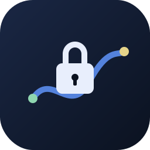
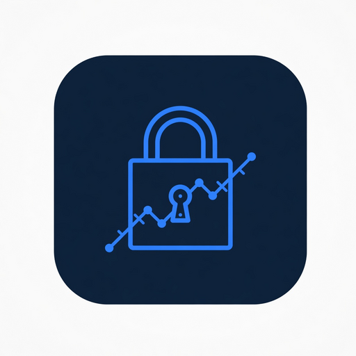
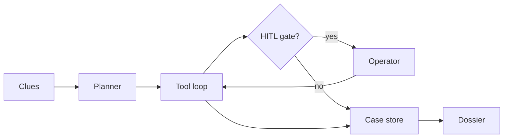
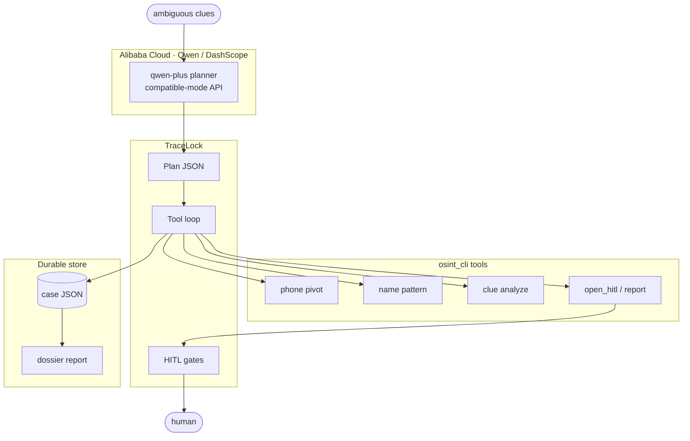

<p align="center">
  
</p>

<h1 align="center">TraceLock</h1>

<p align="center">
  <strong>Investigation autopilot for ambiguous public clues.</strong><br/>
  Plan → tools → human gates → graded dossier.
</p>

<p align="center">
  <a href="LICENSE"></a>
  <a href="https://www.python.org/"></a>
  <a href="https://www.qwencloud.com/"></a>
  <a href="https://github.com/SeraKah-1/tracelock"></a>
</p>

<p align="center">
  <a href="#install">Install</a> ·
  <a href="#quickstart">Quickstart</a> ·
  <a href="#how-it-works">How it works</a> ·
  <a href="#architecture">Architecture</a> ·
  <a href="#policy">Policy</a> ·
  <a href="docs/USAGE.md">Docs</a>
</p>

---

## Why TraceLock

Real investigations rarely start with a clean form. You get a **handle**, a **phone**, or a one-line note — then a pile of tabs.

TraceLock is an **autopilot agent** that:

- plans multi-step public-source work (with **Qwen** on Alibaba DashScope, or offline for demos)
- runs real tools against a durable case file
- **stops** on zero-autonomy gates (browser walls, phone Layer-B, civil lock)
- emits a graded dossier where **digital identity ≠ civil identity**

<p align="center">
  
</p>

---

## Install

```bash
git clone https://github.com/SeraKah-1/tracelock.git
cd tracelock
```

Optional live planner:

```bash
cp .env.example .env   # DASHSCOPE_API_KEY=...
pip install '.[qwen]'
```

---

## Quickstart

```bash
# offline demo (no API key)
python3 -m tracelock run --offline

# your clues
python3 -m tracelock run --offline \
  --clue 'username:example_ig' \
  --clue 'phone:0812xxxxxxx'

# stream events to JSONL (for host agents / demos)
python3 -m tracelock run --offline --events-out /tmp/tracelock-events.jsonl

# operator cockpit: live logs + HITL gate panel (captcha → human, never auto-solve)
python3 -m tracelock serve --port 8765
# → http://127.0.0.1:8765/

# live Qwen planner
export DASHSCOPE_API_KEY=sk-...
python3 -m tracelock run --clue 'username:example_ig'
```

```python
from pathlib import Path
from tracelock.agent import run_agent

result = run_agent(
    clues=["username:example_ig", "phone:081255500100"],
    case_path=Path("/tmp/tracelock-case.json"),
)
print(result.report_markdown)
```

More: [`docs/USAGE.md`](docs/USAGE.md) · cockpit: [`docs/COCKPIT.md`](docs/COCKPIT.md) · scenarios: [`docs/SCENARIOS.md`](docs/SCENARIOS.md)

---

## How it works



| Step | What happens |
|------|----------------|
| **Ingest** | Username, phone, free text → case seeds |
| **Plan** | Qwen (DashScope) or offline planner → ordered tools + HITL checkpoints |
| **Execute** | Phone E.164, SERP packs, name patterns, evidence chain |
| **Gate** | Captcha / portal walls, Layer-B phone checks, civil lock |
| **Report** | Dimensions + markdown dossier |

---

## Architecture



Static diagram: [`docs/assets/architecture.svg`](docs/assets/architecture.svg) · notes: [`docs/ARCHITECTURE.md`](docs/ARCHITECTURE.md)

---

## Who it’s for

| Audience | Use |
|----------|-----|
| Fraud / trust & safety | Phone or handle tickets before deeper review |
| Campus / security desks | Public-source background work with audit trail |
| Agent builders | Tool-calling host that must pause on policy walls |

**Not for:** breach dumps, NIK bots, captcha farms, or auto-opening private social graphs.

---

## Policy

Built into the product, not a footnote:

- Public sources only for automated collection  
- **Digital lock ≠ civil lock**  
- Phone prefix ≠ domicile · wallet display name ≠ national ID  
- No breach / dark-web / NIK modules  

Deep dives: [`docs/PHONE_PIVOT.md`](docs/PHONE_PIVOT.md) · [`docs/HITL_AND_CYBORG.md`](docs/HITL_AND_CYBORG.md) · [`docs/GOV_SOURCES.md`](docs/GOV_SOURCES.md)

---

## Stack

| Layer | Choice |
|-------|--------|
| Planner | Qwen via DashScope OpenAI-compatible API |
| Runtime | Python 3.10+ |
| State | Durable case JSON + evidence chain |
| Full CLI | `python3 -m osint_cli` |

```bash
python3 -m tracelock tools
python3 -m tracelock deploy-proof   # endpoint fingerprint, no secrets
```

Deployment: [`docs/DEPLOYMENT.md`](docs/DEPLOYMENT.md) · client: [`tracelock/qwen_client.py`](tracelock/qwen_client.py)

---

## Project layout

```text
tracelock/          # agent · tools · CLI
osint_cli/          # case engine & collectors
docs/               # usage · architecture · scenarios
docs/assets/        # logo · diagrams
deploy/             # env templates
tests/
```

---

## License

[MIT](LICENSE) · © TraceLock contributors

<p align="center">
  <sub>Built for operators who need autopilot — and know when to take the stick.</sub>
</p>
