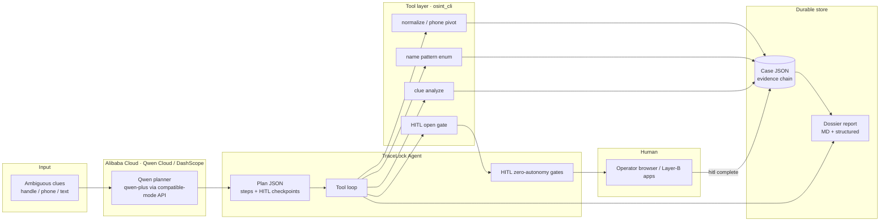

# TraceLock architecture

## Diagram

Renderable source (Mermaid) and static asset for Devpost:

- **SVG (submit this):** [`assets/architecture.svg`](assets/architecture.svg)  
- **Mermaid (edit-friendly):** below  



## Components

| Layer | Module | Responsibility |
|-------|--------|----------------|
| Planner | `tracelock/qwen_client.py` | Call DashScope OpenAI-compatible API; offline stub |
| Orchestrator | `tracelock/agent.py` | Execute plan steps; force report; structured result |
| CLI | `tracelock/demo.py` | `run` / `deploy-proof` / `tools` |
| Tools | `tracelock/tools.py` | Thin wrappers → real `osint_cli` functions |
| Case engine | `osint_cli/*` | Seeds, evidence, HITL, phone, dossier primitives |
| Deploy notes | `deploy/` + `docs/ALIBABA_QWEN_DEPLOYMENT.md` | Env, API base URL, proof path |

## Data flow (one run)

1. CLI loads clues (fixture or `--clue`).  
2. `plan_with_qwen` → `AgentPlan` (`mode=live|offline`).  
3. For each step, `run_tool` mutates case JSON via `osint_cli`.  
4. HITL tools open gates without performing restricted actions.  
5. `report` writes markdown + structured dossier into the result payload.

## Security / ethics boundaries

```text
ALLOWED auto: public normalize, query pack build, local case IO, pattern enum
HITL only:    captcha/browser walls, e-wallet name preview, civil lock confirm
FORBIDDEN:    breach/NIK bots, captcha farms, grey admin APIs, silent empty success
```
