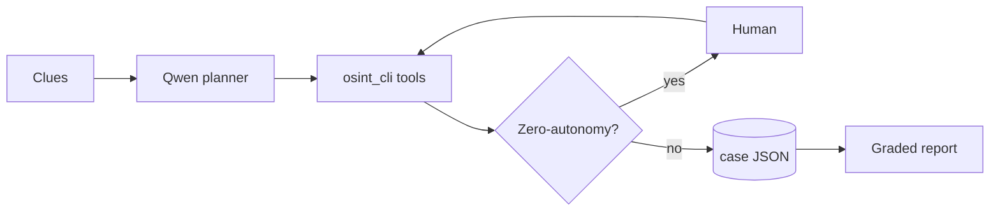

# About the project

## Inspiration

Most investigation work does not start with a clean CRM form. It starts with a **handle**, a **phone number**, or a one-line ticket note. Operators open ten tabs, copy-paste variants of the same number, hit Cloudflare walls, and still risk treating a social account as if it were a national ID.

We wanted an **autopilot** that behaves like a careful analyst: expand what is public, keep a durable evidence trail, and **stop** when only a human should act. The Qwen Cloud Autopilot track matched that idea—end-to-end workflow, tools, ambiguous inputs, and human-in-the-loop at critical decisions—not a chat toy that invents identity.

TraceLock is that product: *plan → tools → HITL gates → graded dossier*, with a hard rule that **digital identity ≠ civil identity**.

## What it does

TraceLock takes mixed public clues (username, phone, free text) and runs an investigation loop:

1. **Plan** multi-step work with Qwen on Alibaba DashScope (or an offline planner for demos/CI).
2. **Execute** real tools—E.164 phone normalize, SERP query packs, name-pattern expansion, case/evidence store.
3. **Open zero-autonomy gates** for browser walls, phone Layer-B checks (e.g. e-wallet name preview), and civil lock confirmation.
4. **Emit** a structured dossier and markdown report with graded dimensions—not silent empty “success.”

Operators and host AI agents can drive the same CLI (`python3 -m tracelock run`) or import `run_agent()` in Python. Deeper collection still sits on the same `osint_cli` case engine.

## How we built it

| Layer | Choice |
|-------|--------|
| Planner | Qwen via DashScope OpenAI-compatible API (`https://dashscope-intl.aliyuncs.com/compatible-mode/v1`) |
| Orchestration | Thin agent loop: plan JSON → tool registry → case JSON |
| Tools | Wrappers over a production-minded OSINT CLI (normalize, phone pivot, HITL, dossier) |
| State | Durable case file + evidence chain on disk |
| Offline twin | Same tool-loop shape without an API key (demo/judge reproducibility) |
| Language | Python 3.10+ · MIT |

Architecture (high level):



Core product rule encoded in policy and report text: **public sources only** for automation; no breach dumps, NIK bots, or captcha farms.

## Challenges we ran into

**Ambiguous intake is the default, not the edge case.** Handles do not equal legal names. We refused “just ask the operator for the full name” as the main path and instead expanded nick patterns and kept civil lock open until multi-signal proof.

**Autonomy without liability.** Full auto feels impressive until the agent invents a civil identity or scrapes past a wall. Designing **HITL as a first-class step** (not an error message) was harder than wiring another tool—especially phone Layer-B, which must never auto-run e-wallet flows.

**Platform walls and empty SERPs.** Public collection fails for boring reasons (Cloudflare, login, zero posts). The agent has to open a gate and continue with partial evidence rather than hallucinate fill-in fields.

**Judge-friendly reproducibility.** Live keys are not always available. We shipped an offline planner that still runs the real tool loop and prints a non-empty dossier so the demo is honest without faking cloud calls.

**Product surface vs packaging noise.** Early docs read like internal coaching. We rewrote the public README for operators—logo, badges, mermaid, usage—and moved Devpost-only notes out of the front door.

## What we learned

- Autopilot value is **workflow + stops**, not longer model answers.
- Separating **digital lock** from **civil lock** prevents the most common OSINT overclaim.
- Offline twin + live Qwen planner is a good pattern for hackathon and production demos.
- Evidence grades and open HITL gates matter more to trust than “more modules.”

## What’s next

- Richer live collect modules under the same HITL policy  
- Optional multi-agent split (collector / differentiator / reporter) with measurable baselines  
- Hosted API skin for teams that do not want raw CLI  

## Try it

```bash
git clone https://github.com/SeraKah-1/tracelock.git
cd tracelock
python3 -m tracelock run --offline
```

Repo: [github.com/SeraKah-1/tracelock](https://github.com/SeraKah-1/tracelock)  
Built with Qwen on Alibaba Cloud DashScope · Track focus: **Autopilot Agent**
